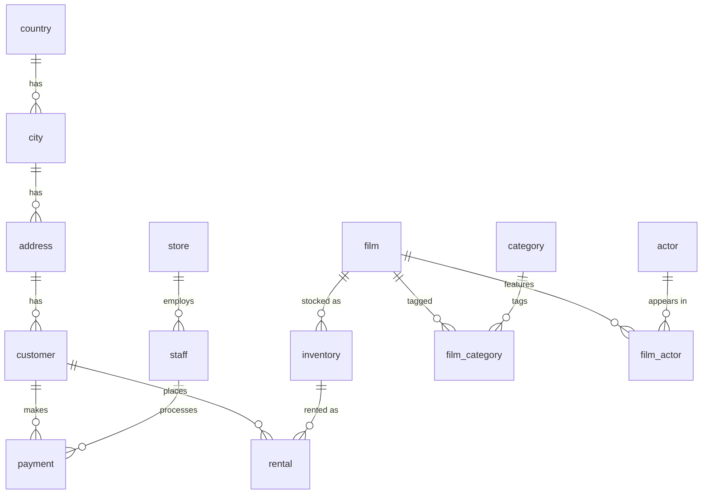

# Entity-Relationship Diagram

```mermaid
erDiagram
    country   ||--o{ city          : has
    city      ||--o{ address       : has
    address   ||--o{ customer      : has
    customer  ||--o{ payment       : makes
    customer  ||--o{ rental        : places
    staff     ||--o{ payment       : processes
    store     ||--o{ staff         : employs
    inventory ||--o{ rental        : "rented as"
    film      ||--o{ inventory     : "stocked as"
    film      ||--o{ film_category : tagged
    category  ||--o{ film_category : tags
    film      ||--o{ film_actor    : features
    actor     ||--o{ film_actor    : "appears in"
```

`||--o{` means one-to-many. Many-to-many links (film↔category, film↔actor)
go through the bridge tables `film_category` and `film_actor`.